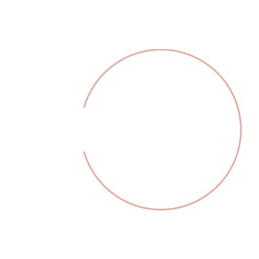

# NerFW

[](https://github.com/Nergan123/NerFW/actions/workflows/Checks.yml)
[](https://badge.fury.io/py/nerfw)
[](https://nerfw.readthedocs.io/en/latest/?badge=latest)



## About

NerFW *(Nergans FrameWork)* is a framework for visual novel creation. This framework
is created in an attempt to make creation of visual novels more convenient for game developers,
and at the same time to make the game harder to pirate. 

NerFW is based on Flask. And is creating a server which hosts the game for you.


## Installation

To install the framework you need to have python 3.10 or higher installed on your computer. 
Then you can install the framework using pip.

```bash
pip install nerfw
```

## Usefull links

- [Read The Docs Documentation](https://nerfw.readthedocs.io/en/latest/index.html)
- [PyPi](https://pypi.org/project/nerfw/)
- [GitHub](https://github.com/Nergan123/NerFW)

## Contacts

- [Discord](https://discordapp.com/users/278900472679628800)
- [GitHub](https://github.com/Nergan123)
- [Email](mailto:noname.nosurname2016@yandex.ru)

### Bug reporting

If you found a bug in the framework, please report it in the 
[issues](https://github.com/Nergan123/NerFW/issues) section of the GitHub repository.

Or you can contact me directly using the contacts above.

## Known Issues

1. Patreon api updates creators token everytime you are logging to your campaign
